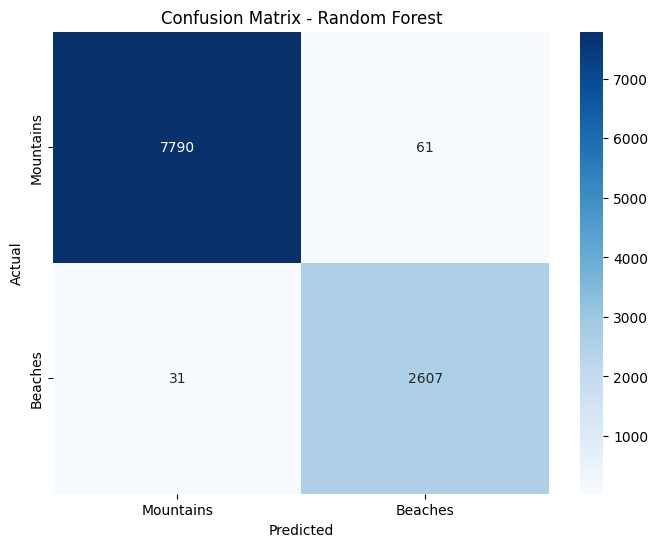
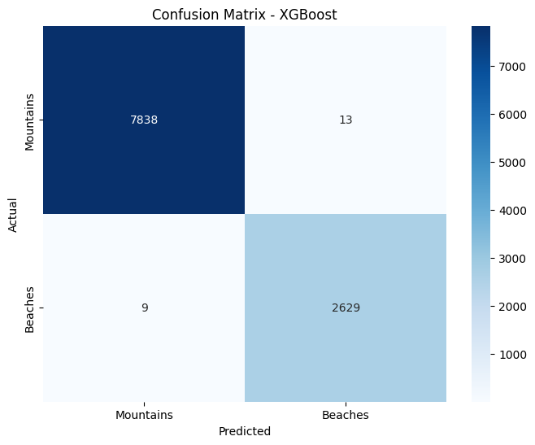
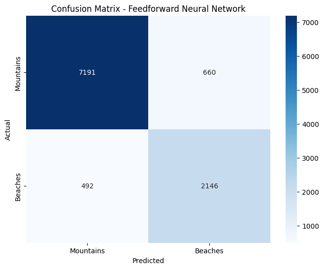
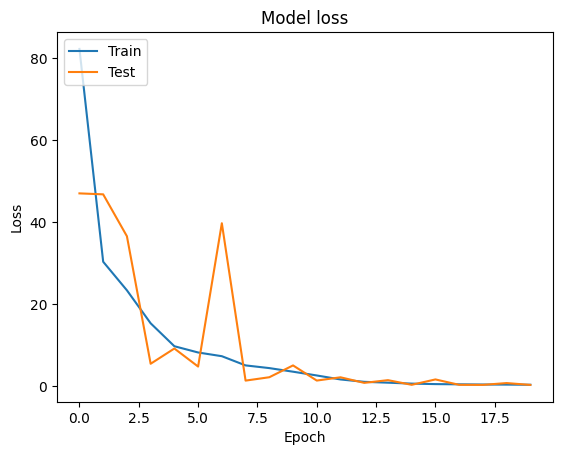
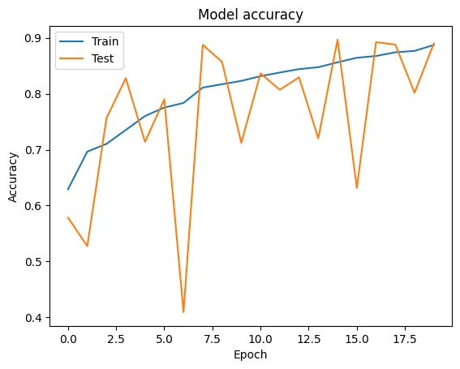
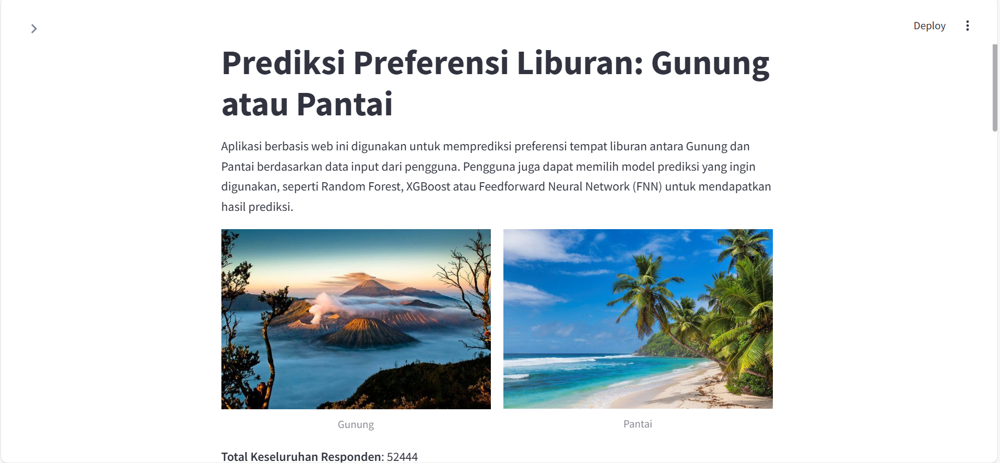
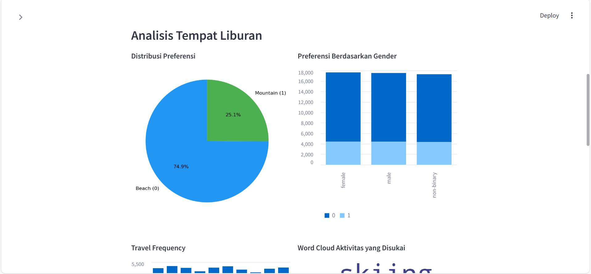
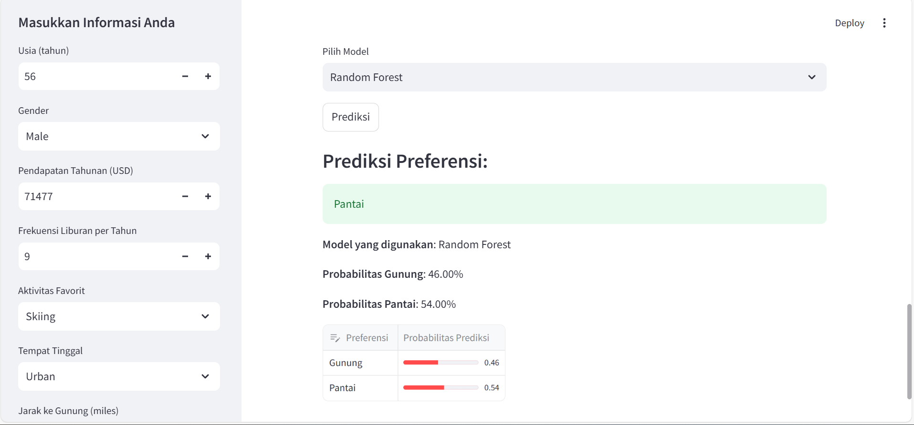

# Prediksi Preferensi Liburan: Gunung atau Pantai

## Deskripsi Proyek

Proyek ini bertujuan untuk mengembangkan aplikasi berbasis web yang dapat memprediksi preferensi tempat liburan antara gunung atau pantai. Prediksi didasarkan pada data demografis dan preferensi individu, seperti usia, gender, pendapatan, aktivitas favorit, dan lain-lain. Aplikasi ini juga menyediakan opsi untuk memilih model prediksi, seperti Random Forest, XGBoost atau Feedforward Neural Network (FNN), sehingga pengguna dapat mengeksplorasi performa dari berbagai algoritma.

### Tujuan Pengembangan

1. Memberikan prediksi yang akurat tentang preferensi liburan pengguna.
2. Memungkinkan eksplorasi performa model yang berbeda.
3. Menyediakan visualisasi data dan analisis yang interaktif untuk meningkatkan pengalaman pengguna.

---

## Dataset

Dataset yang digunakan untuk proyek ini dapat diakses melalui tautan berikut:
**[Mountains vs Beaches Preference Dataset](https://www.kaggle.com/datasets/jahnavipaliwal/mountains-vs-beaches-preference)**

Dataset ini mencakup berbagai fitur demografis dan preferensi individu, yang digunakan untuk melatih dan mengevaluasi model prediksi. Dengan jumlah data dalam dataset sebanyak **52,444** dan **13 fitur**. Berikut ini adalah penjelasan fitur yang ada:

| Fitur                  | Deskripsi                                                                                  |
|------------------------|-------------------------------------------------------------------------------------------|
| **Age**               | Age of the individual (numerical).                                                        |
| **Gender**            | Gender identity of the individual (categorical: male, female, non-binary).                |
| **Income**            | Annual income of the individual (numerical).                                              |
| **Education Level**   | Highest level of education attained (categorical: high school, bachelor, master, doctorate).|
| **Travel Frequency**  | Number of vacations taken per year (numerical).                                           |
| **Preferred Activities** | Activities preferred by individuals during vacations (categorical: hiking, swimming, skiing, sunbathing). |
| **Vacation Budget**   | Budget allocated for vacations (numerical).                                               |
| **Location**          | Type of residence (categorical: urban, suburban, rural).                                  |
| **Proximity to Mountains** | Distance from the nearest mountains (numerical, in miles).                              |
| **Proximity to Beaches**   | Distance from the nearest beaches (numerical, in miles).                               |
| **Favorite Season**   | Preferred season for vacations (categorical: summer, winter, spring, fall).               |
| **Pets**              | Indicates whether the individual owns pets (binary: 0 = No, 1 = Yes).                     |
| **Environmental Concerns** | Indicates whether the individual has environmental concerns (binary: 0 = No, 1 = Yes). |

---

## Langkah Instalasi


1. Clone repositori ini:

   ```bash
   git clone https://github.com/ekanurmairisma/Machine-Learning.git
   ```

2. Navigasikan ke direktori proyek:

   ```bash
   cd Machine-Learning
   ```

3. Buat dan aktifkan virtual environment:

   ```bash
   python -m venv venv
   source venv/bin/activate  # Untuk Linux/MacOS
   venv\Scripts\activate   # Untuk Windows
   ```

4. Instal dependencies:

   ```bash
   pip install -r requirements.txt
   ```

5. Jalankan aplikasi web menggunakan Streamlit:

   ```bash
   python -m streamlit run uap.py
   ```

---

## Deskripsi Model

### Model yang Digunakan

1. **Random Forest:** Algoritma pembelajaran ensemble berbasis pohon keputusan (Decision Tree) yang bekerja dengan cara membangun beberapa pohon keputusan selama pelatihan dan menggabungkan hasilnya untuk menghasilkan prediksi akhir.
2. **XGBoost:** Algoritma boosting berbasis pohon keputusan yang dioptimalkan untuk kecepatan dan performa. XGBoost adalah salah satu algoritma favorit dalam kompetisi data science karena kemampuannya untuk memberikan hasil yang sangat baik.
3. **Feedforward Neural Network (FNN):** Tipe sederhana dari jaringan saraf tiruan (Artificial Neural Network). Informasi dalam FNN mengalir maju dari input ke output melalui lapisan tersembunyi tanpa adanya umpan balik (feedback).

### Penanganan Ketidakseimbangan Data

Ketidakseimbangan data pada proses ini ditangani menggunakan SMOTE (Synthetic Minority Oversampling Technique) yang menciptakan sampel sintetis untuk kelas minoritas dan memastikan pelatihan model lebih adil.

```python
from imblearn.over_sampling import SMOTE

smote = SMOTE(random_state=42)
X_resampled, y_resampled = smote.fit_resample(X_train, y_train)
```


### Analisis Performa

- **Random Forest:** Mencapai kinerja yang seimbang di kedua kelas (Gunung dan Pantai). Serta menunjukkan nilai precision, recall dan f1-score yang baik, yang menunjukkan efektivitasnya dalam mengklasifikasikan kedua preferensi. 
- **XGBoost:** Menunjukkan kinerja yang baik juga dalam precision, recall dan f1-score. XGBoost sedikit lebih baik dalam mengidentifikasi Gunung daripada Random Forest.
- **FNN:** Berdasarkan akurasinya, FNN menunjukkan kinerja yang baik tetapi mungkin sedikit kurang presisi daripada model Random Forest dan XGBoost. FNN juga mungkin memerlukan penyempurnaan lebih lanjut untuk mencapai atau melampaui performa dari model Forest dan XGBoost.

---

## Hasil dan Analisis

### Analisis Performa

#### Random Forest Evaluation:
```
              precision    recall  f1-score   support

           0       1.00      0.99      0.99      7851
           1       0.98      0.99      0.98      2638

    accuracy                           0.99     10489
   macro avg       0.99      0.99      0.99     10489
weighted avg       0.99      0.99      0.99     10489
```

#### XGBoost Evaluation:
```
              precision    recall  f1-score   support

           0       1.00      1.00      1.00      7851
           1       1.00      1.00      1.00      2638

    accuracy                           1.00     10489
   macro avg       1.00      1.00      1.00     10489
weighted avg       1.00      1.00      1.00     10489
```

#### Feedforward Neural Network Evaluation:
```
              precision    recall  f1-score   support

           0       0.94      0.92      0.93      7851
           1       0.76      0.81      0.79      2638

    accuracy                           0.89     10489
   macro avg       0.85      0.86      0.86     10489
weighted avg       0.89      0.89      0.89     10489
```

### Perbandingan Performa Model

| Model                      | Akurasi (%) | Precision (%) | Recall (%) | F1-Score (%) |
| -------------------------- | ----------- | ------------- | ---------- | ------------ |
| Random Forest              | 0.99        | 0.99          | 0.99       | 0.99         |
| XGBoost                    | 1.00        | 1.00          | 1.00       | 1.00         |
| Feedforward Neural Network | 0.89        | 0.85          | 0.86       | 0.86         |

### Visualisasi Hasil

- **Confusion Matrix**
  Menunjukkan distribusi prediksi benar dan salah dari masing-masing model. Berikut adalah visualisasi confusion matrix untuk setiap model:

  - **Random Forest:**
    
  - **XGBoost:**
    
  - **Feedforward Neural Network:**
    
    Dengan grafik loss dan accuracy sebagai berikut. 
    
    


---

## Local Web Deployment

- **Tampilan HomePage**
    

- **Tampilan Analisis**
     

- **Tampilan Prediction Result**
    

## Link Live Demo

Aplikasi ini telah di-deploy dan dapat diakses melalui tautan berikut:
**[Live Demo Aplikasi](https://example.com)**

---

## Author

@ekanurmairisma

---
Terima kasih telah menggunakan aplikasi prediksi preferensi liburan ini! 

